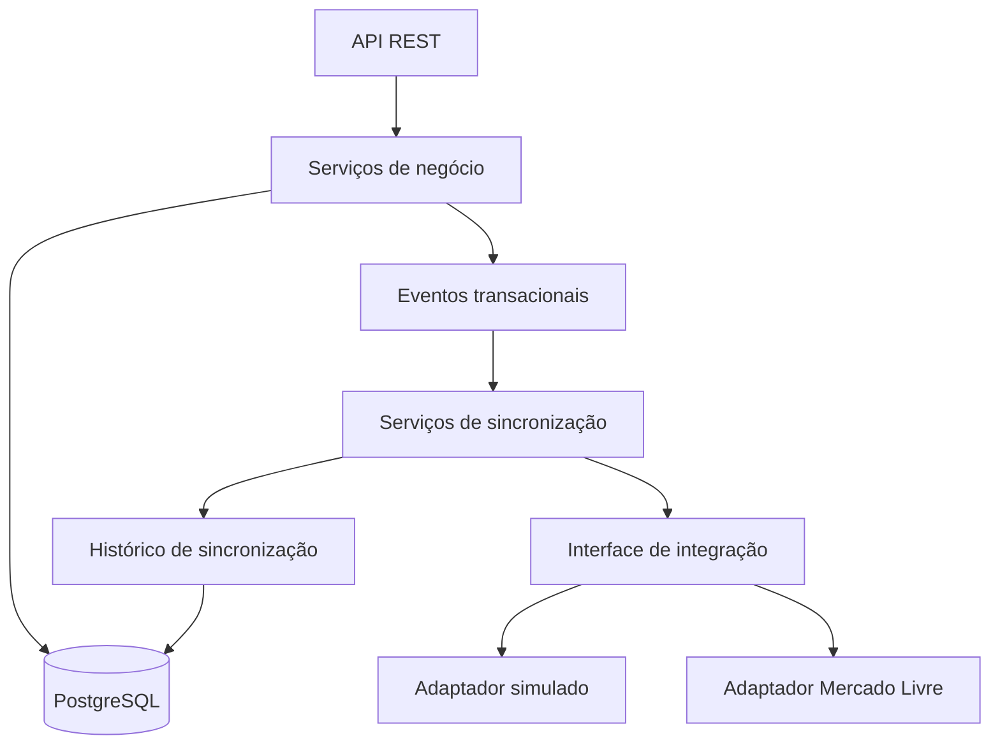

# StockSync

[](https://github.com/ErikFerreira1/StockSync/actions/workflows/ci.yml)

**Gestão de estoque com sincronização de anúncios no Mercado Livre.**

Projeto de portfólio backend em Java e Spring Boot que centraliza produtos, estoque e pedidos, atualiza anúncios vinculados e registra o resultado de cada sincronização. A versão atual oferece API REST, documentação interativa e um modo demo com marketplace simulado.

**Tecnologias principais:** Java 17 · Spring Boot · PostgreSQL · Spring Security/JWT · Docker · JUnit · Testcontainers

## Visão geral

| Área | O que o sistema oferece |
| --- | --- |
| Produtos e estoque | Cadastro de produtos, entradas e saídas, estoque mínimo e histórico de movimentações. |
| Pedidos | Registro, importação do Mercado Livre e cancelamento com reposição de estoque. |
| Canais e anúncios | Gestão de canais, vínculo de anúncios e sincronização de quantidade, pausa e reativação. |
| Integração | OAuth com Mercado Livre, renovação de tokens e credenciais criptografadas. |
| Controle de acesso | Perfis de administrador, operador e consulta, com autenticação JWT. |
| Rastreabilidade | Histórico de sincronizações bem-sucedidas e falhas por produto. |

### Como funciona

Uma venda ou movimentação altera o estoque local. Após a confirmação no banco, eventos acionam a sincronização dos anúncios elegíveis e o resultado fica registrado para consulta. Desativar um produto pausa seus anúncios; reativá-lo recupera os anúncios pausados por esse fluxo com a quantidade atual.

Por exemplo: uma saída de duas unidades reduz o saldo de `12` para `10` e atualiza o anúncio vinculado para `10`. A integração atual sincroniza **estoque e status**, sem atualização automática de preços.

## Teste o projeto

### Demo online

**[Abrir o Swagger da demo](https://vividness-gratuity-foothold.ngrok-free.dev/swagger-ui.html)** — experimente a API sem instalar o projeto.

1. Se o ngrok exibir uma tela inicial, clique em **Visit Site** para continuar.
2. Execute `POST /auth/login` com usuário `demo` e senha `stocksync-demo`.
3. Copie o `accessToken` da resposta e cole em **Authorize**.
4. Consulte `GET /products` para ver os produtos de exemplo. O roteiro completo de movimentação e sincronização está na seção **Modo demo** abaixo.

A demo é compartilhada, usa dados fictícios e simula o Mercado Livre. Os registros de exemplo são restaurados na inicialização. Hospedada em um celular Android com Termux, Java e PostgreSQL, ela pode ficar indisponível durante manutenção ou ao atingir os limites do túnel gratuito. Se estiver offline, execute localmente com Docker.

### Execução local

Com Docker e Docker Compose disponíveis, execute na pasta do projeto:

```bash
docker compose up --build
```

Abra o [Swagger UI](http://localhost:8080/swagger-ui.html), faça login em `POST /auth/login` com usuário `demo` e senha `stocksync-demo`, copie o `accessToken` e cole em **Authorize**.

A demonstração já prepara dois produtos e anúncios simulados. Consulte o catálogo, registre uma saída e acompanhe a sincronização — sem conta do Mercado Livre ou configuração de OAuth. O roteiro completo está na seção expansível **Modo demo** abaixo.

## Próximas evoluções

- **Outros marketplaces:** novos adaptadores para ampliar a gestão centralizada entre plataformas.
- **Interface web:** telas para acompanhar produtos, estoque, pedidos, anúncios e sincronizações.

Esses recursos estão planejados. Hoje, o projeto é acessado pela API/Swagger, com demo online e execução local disponíveis. A integração real disponível é com o Mercado Livre.

---

## Detalhes técnicos e guias

Expanda apenas o assunto que deseja explorar.

<details>
<summary>Regras de negócio e permissões</summary>

### Gestão de produtos e estoque

- Cadastro e edição de produtos com SKU, nome, descrição e preço-base.
- Consulta de produtos e das respectivas quantidades disponíveis.
- Controle de estoque mínimo por produto e consulta dos itens abaixo desse limite.
- Registro de entradas e saídas manuais, com quantidade, origem, data e observação.
- Ativação e desativação de produtos.
- Histórico de movimentações para acompanhar como o saldo de cada produto foi alterado.

### Canais de venda e anúncios

- Cadastro, edição, ativação e desativação de canais de venda.
- Vínculo entre um produto local e um anúncio do marketplace, utilizando o identificador externo do anúncio.
- Sincronização de quantidade para os anúncios ativos elegíveis após a confirmação da alteração no banco.
- Pausa dos anúncios ativos vinculados a canais ativos quando o produto é desativado.
- Reativação dos anúncios pausados pela desativação do produto, enviando a quantidade local atual.

A reativação considera a origem da pausa: anúncios que já estavam pausados por outro motivo não são reativados automaticamente por esse fluxo.

O preço-base é um atributo do produto local. A sincronização implementada contempla **estoque e status**; alterar o preço-base não atualiza automaticamente o preço no Mercado Livre. Cadastrar um vínculo de anúncio também não equivale à publicação de um novo anúncio no marketplace.

### Pedidos e movimentações

- Registro e consulta de pedidos com seus itens e quantidades.
- Baixa de estoque associada à venda.
- Cancelamento de pedidos com reposição das quantidades ao estoque.
- Importação de pedidos do Mercado Livre, acionada pela API.
- Proteções contra importação duplicada e cenários de concorrência, verificadas por testes de integração.

### Integração e rastreabilidade

- Autorização de contas do Mercado Livre pelo fluxo OAuth.
- Renovação de tokens de acesso e armazenamento criptografado das credenciais de integração.
- Registro de eventos de sincronização com sucesso ou falha.
- Consulta do histórico por produto e dos eventos que falharam.

### Autenticação e permissões

O acesso à API utiliza tokens JWT e três perfis de usuário:

| Perfil | Acesso |
| --- | --- |
| `ADMIN` | Operações administrativas, incluindo gestão de usuários e credenciais de integração. |
| `OPERATOR` | Operações de produtos, estoque, pedidos e canais, sem acesso à administração de usuários e credenciais. |
| `VIEWER` | Consultas dos recursos operacionais, sem permissão para alterá-los. |

O login possui limitação de tentativas por IP em cada instância da aplicação. No modo demo, a conta disponibilizada é do tipo `OPERATOR`, e a troca de sua senha pela API é bloqueada.

</details>

<details>
<summary>Modo demo — instalação, roteiro de testes e limites</summary>

O modo demo permite conhecer o fluxo de gestão e sincronização sem configurar uma conta do Mercado Livre, autorizar uma integração ou utilizar ngrok. Ele utiliza PostgreSQL e um adaptador que simula o estado dos anúncios externos, mantendo os mesmos serviços e eventos responsáveis pela sincronização.

### Pré-requisitos e inicialização

É necessário ter Docker e Docker Compose disponíveis. O Java, o Maven e o PostgreSQL utilizados pela aplicação são executados nos containers.

Na pasta do projeto, execute:

```bash
docker compose up --build
```

Na primeira execução, o Docker baixa as imagens e dependências, compila o projeto, inicia o banco e aplica as migrações. Aguarde a aplicação concluir a inicialização.

O Compose utiliza o perfil `demo` por padrão. Em uma cópia nova do projeto, não é necessário criar um arquivo `.env` para experimentar. Caso já exista um `.env`, seus valores podem substituir as configurações padrão. O arquivo [.env.example](.env.example) apresenta as variáveis disponíveis.

As portas padrão são `8080` para a API e `5432` para o PostgreSQL. Se já estiverem ocupadas, configure `APP_PORT` e `POSTGRES_PORT`. Utilize um banco dedicado à demonstração: os registros de exemplo são restaurados na inicialização do perfil `demo`.

### Acesso pelo Swagger

Abra [http://localhost:8080/swagger-ui.html](http://localhost:8080/swagger-ui.html). Se alterou `APP_PORT`, ajuste a porta no endereço.

O Swagger apresenta os endpoints e permite enviar requisições pelo navegador. Para autenticar:

1. Abra `POST /auth/login` e clique em **Try it out**.
2. Informe o corpo abaixo e clique em **Execute**.
3. Copie o campo `accessToken` da resposta.
4. Clique em **Authorize**, cole somente o token e confirme.

```json
{
  "username": "demo",
  "password": "stocksync-demo"
}
```

Essas são as credenciais padrão. Elas podem ser alteradas pelas variáveis `DEMO_USERNAME` e `DEMO_PASSWORD` antes da inicialização.

### Dados de exemplo

A aplicação prepara uma conta demo, um canal de venda simulado e dois produtos com anúncios vinculados:

| Produto | SKU | Estoque inicial | Estoque mínimo | Preço-base |
| --- | --- | --- | --- | --- |
| Cabo USB-C reforçado | `DEMO-USB-C` | 12 | 3 | R$ 25,00 |
| Teclado mecânico compacto | `DEMO-KEYBOARD` | 2 | 5 | R$ 149,90 |

O teclado começa abaixo do estoque mínimo para demonstrar a consulta de itens que precisam de reposição.

### Roteiro de demonstração

1. Consulte `GET /products` e anote o ID do cabo USB-C.
2. Consulte `GET /inventory/below-minimum` para visualizar o teclado abaixo do limite.
3. Consulte `GET /demo/marketplace-listings` para observar o estoque e o status dos anúncios simulados.
4. Registre uma saída manual com `POST /stock-movement`, utilizando o ID do cabo no campo `productId`:

   ```json
   {
     "productId": 1,
     "quantity": 1,
     "type": "MANUAL_DECREASE",
     "note": "Teste de sincronização no modo demo"
   }
   ```

5. Consulte novamente o produto e os anúncios simulados. Partindo dos dados iniciais, a quantidade do cabo passa de `12` para `11` nos dois lados.
6. Execute `PATCH /products/{id}/deactivate`. O anúncio correspondente passa para `PAUSED`.
7. Execute `PATCH /products/{id}/activate`. O anúncio retorna para `ACTIVE` com o estoque local atual.
8. Consulte `GET /stock-movement/product/{productId}` para ver a movimentação e `GET /sync-events/product/{productId}` para acompanhar os resultados das sincronizações.

Em um banco novo, os produtos normalmente recebem os IDs `1` e `2`. Utilize sempre os IDs retornados pela API, pois eles podem variar. Para demonstrar uma entrada de estoque, registre uma movimentação com `type` igual a `MANUAL_INCREASE` e uma quantidade positiva.

### Comportamento e limites da simulação

- Os anúncios simulados ficam em memória; produtos, pedidos, movimentações e eventos são armazenados no PostgreSQL.
- A simulação não envia requisições nem altera anúncios reais no Mercado Livre.
- A importação externa de pedidos retorna uma lista vazia no adaptador demo; ele não gera vendas fictícias automaticamente.
- Os dois anúncios de exemplo são registrados na inicialização. Cadastrar outro vínculo local não cria um anúncio adicional no simulador.
- Ao reiniciar a aplicação, a conta demo e os dados dos produtos e anúncios de exemplo são restaurados. Isso não apaga todo o histórico nem os demais registros criados durante os testes.
- As rotas de usuários, credenciais e OAuth não aparecem na documentação do perfil demo; a conta demo não possui acesso administrativo.

### Parar ou reiniciar a demonstração

Para parar os containers mantendo o banco:

```bash
docker compose down
```

Para apagar completamente o banco da demonstração e começar novamente:

```bash
docker compose down -v
docker compose up --build
```

> A opção `-v` remove permanentemente o volume do banco associado ao projeto Compose. Use esse comando apenas no ambiente de demonstração que deseja apagar.

</details>

<details>
<summary>Arquitetura e organização do código</summary>

A aplicação separa a entrada HTTP, as regras de negócio, a persistência e a comunicação com o marketplace. Os serviços dependem de uma interface de integração, e o perfil ativo seleciona a implementação real ou simulada.



No fluxo de estoque e status, a sincronização é acionada após a confirmação da transação local. Seus resultados são registrados para consulta. Uma falha na comunicação externa pode deixar o anúncio temporariamente diferente do estado local, e o histórico permite identificar essa situação.

A interface de integração concentra os detalhes de comunicação no adaptador de cada marketplace. O suporte a novas plataformas ainda exige implementar seus adaptadores e regras específicas.

### Organização do código

Os pacotes abaixo estão em `src/main/java/com/erikferreira/stocksync`:

| Pacote | Responsabilidade |
| --- | --- |
| `controller` | Endpoints da API REST. |
| `service` | Regras de negócio e operações da aplicação. |
| `entity` | Entidades persistidas e seus relacionamentos. |
| `repository` | Acesso aos dados com Spring Data JPA. |
| `dto` | Estruturas de entrada e saída da API. |
| `integration` | Contratos e adaptadores de integração externa. |
| `listener` | Tratamento dos eventos que acionam a sincronização. |
| `config` | Configurações, segurança e inicialização dos dados demo. |

As migrações Flyway ficam em `src/main/resources/db/migration`, e os testes em `src/test`.

</details>

<details>
<summary>Tecnologias e suas responsabilidades</summary>

| Tecnologia | Utilização |
| --- | --- |
| Java 17 e Spring Boot 3.5 | Desenvolvimento e execução do backend. |
| Spring Web e Bean Validation | API REST e validação das requisições. |
| Spring Security e JWT | Autenticação e autorização. |
| Spring Data JPA e Hibernate | Persistência e mapeamento das entidades. |
| PostgreSQL 17 | Banco de dados relacional. |
| Flyway | Evolução versionada do esquema do banco. |
| Springdoc OpenAPI e Swagger UI | Documentação interativa da API. |
| Docker e Docker Compose | Execução da aplicação e do banco em containers. |
| Maven e Maven Wrapper | Gerenciamento de dependências e compilação. |
| JUnit 5 e Mockito | Testes automatizados e simulação de dependências. |
| Testcontainers | Testes de integração com PostgreSQL em containers. |
| JaCoCo | Relatório de cobertura dos testes. |

</details>

<details>
<summary>Testes automatizados e cobertura</summary>

Para executar os testes fora do container da aplicação, é necessário ter um JDK compatível com Java 17 e Docker disponível. O Maven Wrapper está incluído no repositório.

```bash
./mvnw test
```

Os testes abrangem regras de estoque e pedidos, permissões, integração com o banco, sincronização, duplicidade, concorrência e o modo demo. O Testcontainers prepara bancos temporários para os testes de integração.

Para executar a verificação e gerar o relatório de cobertura:

```bash
./mvnw verify
```

O relatório do JaCoCo fica em `target/site/jacoco/index.html`. No Windows, utilize `mvnw.cmd` no lugar de `./mvnw`.

### Integração contínua com GitHub Actions

O workflow [StockSync CI](.github/workflows/ci.yml) executa a cada push e em pull requests destinados à `main`. Também pode ser iniciado manualmente pela aba **Actions** do repositório.

O pipeline prepara o Java 17, executa `verify`, disponibiliza os relatórios de testes e cobertura por sete dias e verifica a construção da imagem Docker. Os testes de integração utilizam bancos temporários criados pelo Testcontainers. O workflow não publica imagens nem realiza deploy.

O badge no início deste README mostra o resultado do CI na branch `main` após a execução no GitHub.

</details>

<details>
<summary>Configuração da integração real com o Mercado Livre</summary>

O modo real exige uma aplicação configurada no Mercado Livre, as respectivas credenciais e a autorização da conta que será conectada.

1. Crie um arquivo `.env` com base em [.env.example](.env.example).
2. Configure `SPRING_PROFILES_ACTIVE=default` para utilizar o adaptador real. No Compose, deixar essa variável ausente ou vazia seleciona o perfil `demo`.
3. Configure o acesso ao PostgreSQL, as credenciais iniciais do administrador, `JWT_SECRET`, `ENCRYPTION_KEY` e `MERCADO_LIVRE_REDIRECT_URI`.
4. Cadastre o canal de venda e as credenciais de integração pela API com uma conta administrativa.
5. Inicie a autorização em `GET /mercadolivre/authorize/{salesChannelId}` com autenticação administrativa e conclua o fluxo no navegador, preservando o cookie de estado OAuth.

O endereço de retorno deve corresponder ao callback configurado na aplicação do Mercado Livre e encaminhar para `/mercadolivre/callback`. Cada conta conectada precisa autorizar o acesso.

Para executar o backend pela IDE, inicie apenas o banco:

```bash
docker compose up -d postgres
```

Configure também `POSTGRES_URL`, por exemplo `jdbc:postgresql://localhost:5432/stocksync`, ajustando a porta e o nome do banco. Essa variável é definida automaticamente para o serviço `app` no Compose, mas precisa estar disponível ao executar pela IDE ou pelo Maven.

Inicie a classe `StockSyncApplication` ou execute:

```bash
./mvnw spring-boot:run
```

As chaves e senhas padrão do Compose são destinadas à demonstração local. Substitua-as antes de hospedar a aplicação ou conectar contas reais. Não versione `.env`, tokens ou segredos de integração.

</details>

