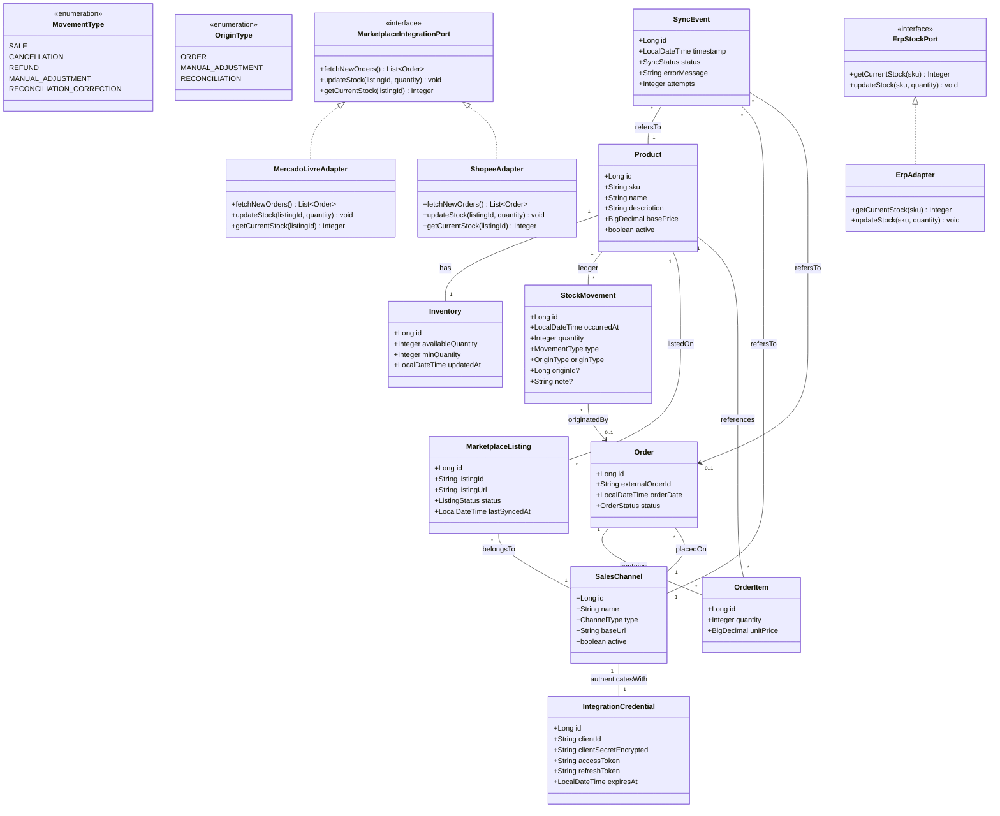
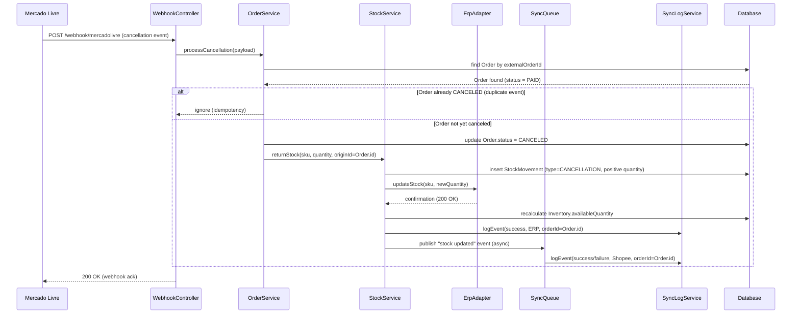

# Revised Diagrams (English)

## Class Diagram

```mermaid
classDiagram
    class Product {
        +Long id
        +String sku
        +String name
        +String description
        +BigDecimal basePrice
        +boolean active
    }

    class Inventory {
        +Long id
        +Integer availableQuantity
        +Integer minQuantity
        +LocalDateTime updatedAt
    }

    class StockMovement {
        +Long id
        +LocalDateTime occurredAt
        +Integer quantity
        +MovementType type
        +OriginType originType
        +Long originId?
        +String note?
    }

    class MovementType {
        <<enumeration>>
        SALE
        CANCELLATION
        REFUND
        MANUAL_ADJUSTMENT
        RECONCILIATION_CORRECTION
    }

    class OriginType {
        <<enumeration>>
        ORDER
        MANUAL_ADJUSTMENT
        RECONCILIATION
    }

    class MarketplaceListing {
        +Long id
        +String listingId
        +String listingUrl
        +ListingStatus status
        +LocalDateTime lastSyncedAt
    }

    class SalesChannel {
        +Long id
        +String name
        +ChannelType type
        +String baseUrl
        +boolean active
    }

    class IntegrationCredential {
        +Long id
        +String clientId
        +String clientSecretEncrypted
        +String accessToken
        +String refreshToken
        +LocalDateTime expiresAt
    }

    class Order {
        +Long id
        +String externalOrderId
        +LocalDateTime orderDate
        +OrderStatus status
    }

    class OrderItem {
        +Long id
        +Integer quantity
        +BigDecimal unitPrice
    }

    class SyncEvent {
        +Long id
        +LocalDateTime timestamp
        +SyncStatus status
        +String errorMessage
        +Integer attempts
    }

    class MarketplaceIntegrationPort {
        <<interface>>
        +fetchNewOrders() List~Order~
        +updateStock(listingId, quantity) void
        +getCurrentStock(listingId) Integer
    }

    class ErpStockPort {
        <<interface>>
        +getCurrentStock(sku) Integer
        +updateStock(sku, quantity) void
    }

    class MercadoLivreAdapter {
        +fetchNewOrders() List~Order~
        +updateStock(listingId, quantity) void
        +getCurrentStock(listingId) Integer
    }

    class ShopeeAdapter {
        +fetchNewOrders() List~Order~
        +updateStock(listingId, quantity) void
        +getCurrentStock(listingId) Integer
    }

    class ErpAdapter {
        +getCurrentStock(sku) Integer
        +updateStock(sku, quantity) void
    }

    Product "1" -- "1" Inventory : has
    Product "1" -- "*" StockMovement : ledger
    StockMovement "*" --> "0..1" Order : originatedBy
    Product "1" -- "*" MarketplaceListing : listedOn
    MarketplaceListing "*" -- "1" SalesChannel : belongsTo
    SalesChannel "1" -- "1" IntegrationCredential : authenticatesWith
    Order "1" -- "*" OrderItem : contains
    OrderItem "*" -- "1" Product : references
    Order "*" -- "1" SalesChannel : placedOn
    SyncEvent "*" -- "1" Product : refersTo
    SyncEvent "*" -- "1" SalesChannel : refersTo
    SyncEvent "*" --> "0..1" Order : refersTo

    MarketplaceIntegrationPort <|.. MercadoLivreAdapter
    MarketplaceIntegrationPort <|.. ShopeeAdapter
    ErpStockPort <|.. ErpAdapter
```

## Sequence Diagram — Order Cancellation

```mermaid
sequenceDiagram
    participant ML as Mercado Livre
    participant CTRL as WebhookController
    participant ORD as OrderService
    participant STK as StockService
    participant ERP as ErpAdapter
    participant Q as SyncQueue
    participant LOG as SyncLogService
    participant DB as Database

    ML->>CTRL: POST /webhook/mercadolivre (cancellation event)
    CTRL->>ORD: processCancellation(payload)
    ORD->>DB: find Order by externalOrderId
    DB-->>ORD: Order found (status = PAID)

    alt Order already CANCELED (duplicate event)
        ORD-->>CTRL: ignore (idempotency)
    else Order not yet canceled
        ORD->>DB: update Order.status = CANCELED
        ORD->>STK: returnStock(sku, quantity, originId=Order.id)

        STK->>DB: insert StockMovement (type=CANCELLATION, positive quantity)
        STK->>ERP: updateStock(sku, newQuantity)
        ERP-->>STK: confirmation (200 OK)
        STK->>DB: recalculate Inventory.availableQuantity

        STK->>LOG: logEvent(success, ERP, orderId=Order.id)
        STK->>Q: publish "stock updated" event (async)
        Q->>LOG: logEvent(success/failure, Shopee, orderId=Order.id)
    end

    CTRL-->>ML: 200 OK (webhook ack)
```
